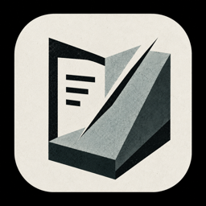
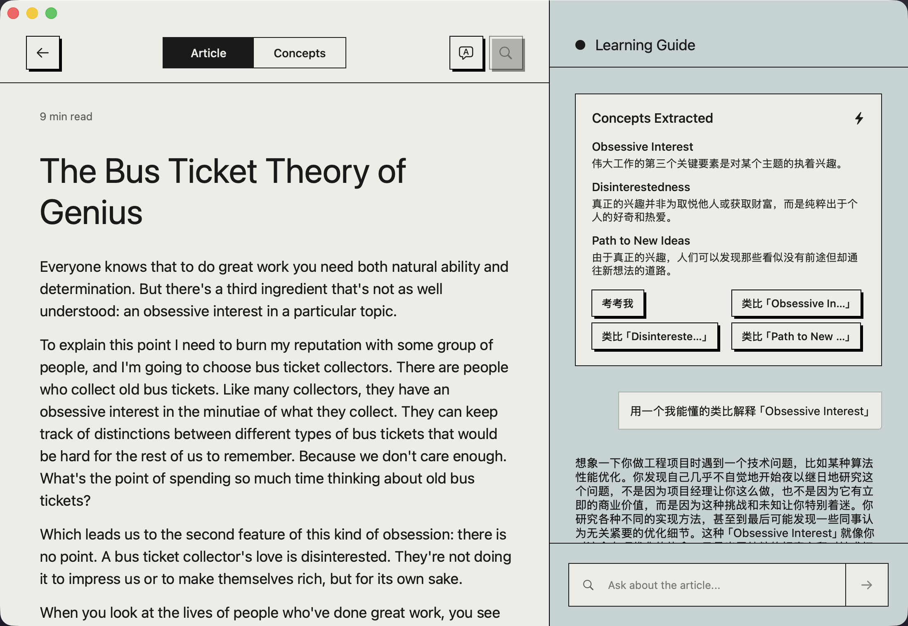
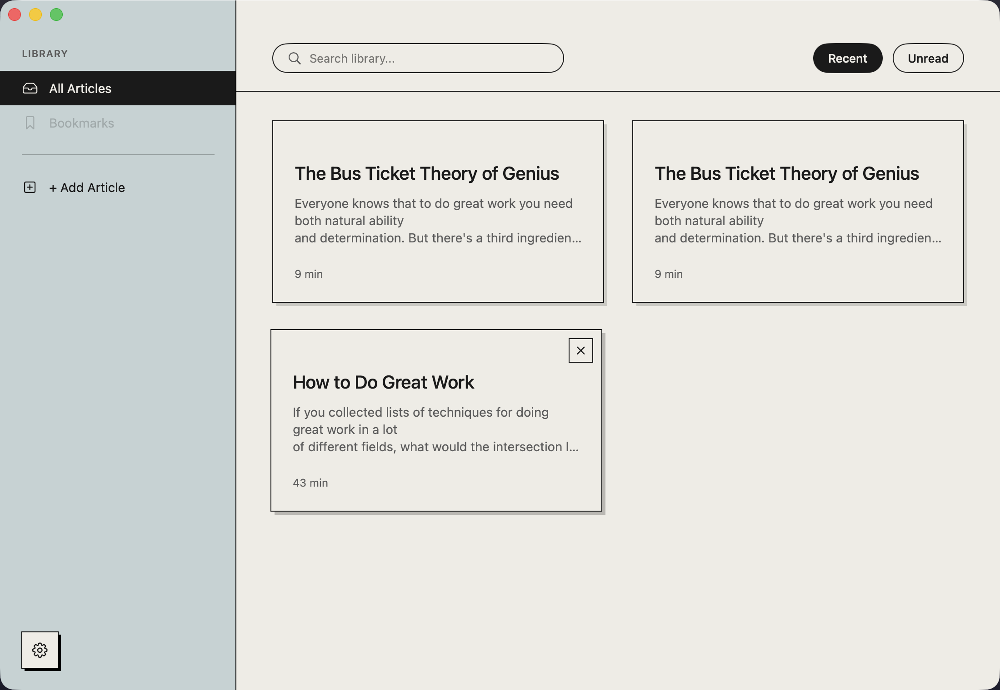

<div align="center">



# Whetstone

**A macOS app that turns articles you read into knowledge you actually keep.**

[](https://github.com/oliverxuzy-ai/Whetstone/releases/latest)
[](https://github.com/oliverxuzy-ai/Whetstone/releases/latest)
[](https://swift.org)
[](./LICENSE)

</div>

Drop a URL. An AI tutor — using [Feynman](https://en.wikipedia.org/wiki/Feynman_Technique) and [Socratic](https://en.wikipedia.org/wiki/Socratic_questioning) methods, tailored to your profession — helps you internalize what matters. Score yourself only when you're ready to be tested.

<div align="center">



</div>

> **Status:** v0 — the full read → understand → self-test loop is wired and in active personal dogfooding. The three core AI prompts passed manual P1 validation; the app is single-user and local-only (no cloud sync yet).

## Install

Grab the latest **`Whetstone-x.y.z.dmg`** from **[Releases](https://github.com/oliverxuzy-ai/Whetstone/releases/latest)**.

1. Double-click the `.dmg` to mount it.
2. Drag `Whetstone.app` into `/Applications`.
3. **First launch:** right-click `Whetstone.app` → *Open* → *Open* (the build is ad-hoc signed, not notarized, so Gatekeeper needs an explicit "I know what I'm doing" the first time).

**Auto-update.** Whetstone checks for new releases automatically via [Sparkle](https://sparkle-project.org/) (EdDSA-signed `appcast.xml` hosted on the latest GitHub release). When a newer version is available the app shows a standard "An update is available" dialog. Manual trigger: *Whetstone* menu → *Check for Updates…*.

---

## Why

You read 50 articles a month. Three days later you remember 3.

Existing tools (Pocket, Readwise, Recall) optimize for **capture** and surface-level review. Whetstone optimizes for **comprehension** — did the AI think you actually understood it? Inspired by Feynman ("explain it simply or you don't understand it") and Socratic questioning ("why do you believe X?").

**Companion, not interrogator.** v0 design choice: the AI extracts concepts and answers questions while you read; it only quizzes you when you point at the "考考我" chip yourself. No surprise tests.

## Features (v0)

| | |
|---|---|
| **Paste a URL → clean article in seconds** | WKWebView + Mozilla Readability.js strips the page down to readable text |
| **AI extracts the core concepts** | 2–7 key ideas (the count scales with the article's complexity), each with a one-line explanation — served as the first thing you see |
| **Persona-tuned analogies** | Onboarding asks your profession + context; every explanation is calibrated to your daily experience |
| **Inline bilingual translation** | One click re-renders the article as EN / 中文 paragraph pairs; cached so you can toggle instantly |
| **Highlight as you read** | Select text → colored highlight, persisted per article (and re-matched so it survives the bilingual toggle) |
| **Article / Concepts tabs** | Flip between the prose and the extracted concept list without losing your place |
| **Free-form chat in the side pane** | Ask anything about the article — the full text is injected as context |
| **"考考我" quiz chip** | Triggers a 3-question Socratic evaluation. Get a 0–100 score *only* when you opt in |
| **Library with history** | Every article you've engaged with: reading time, search + filter, latest quiz score |

## Screens

<div align="center">



</div>

## Stack

- **macOS 14+** native · SwiftUI · SwiftData (local; CloudKit deferred to v1)
- **OpenAI Chat Completions API** — `gpt-4o`, with automatic prompt caching on the article-context prefix
- **WKWebView + [Mozilla Readability.js](https://github.com/mozilla/readability)** for article extraction
- **NSTextView body** with custom selection color + floating selection popover for highlights
- **macOS Keychain** (data-protection keychain via the Security framework) for API-key storage — scoped to the app, read without password prompts, no third-party dependency
- **[Sparkle 2](https://sparkle-project.org/)** for auto-update (EdDSA-signed appcast served from GH Releases)
- **`WhetstoneCore`** — a local SPM package holding the data models, AI client, and prompt templates, kept separate from the SwiftUI app target
- **Quiet neobrutalism editorial aesthetic** (UI V1.0) — single-window three-region layout (collapsible nav/list · reader · AI pane); warm cream `#EFECE5` + sage `#C5D2D3`, 1px borders, 5px corners + hard 2px offset shadows, one rust accent `#C04A2B`, Helvetica Neue

Project is generated from `project.yml` via [xcodegen](https://github.com/yonaskolb/XcodeGen).

## Build & run

Requires Xcode 15+ and `xcodegen`.

```bash
brew install xcodegen
git clone git@github.com:oliverxuzy-ai/Whetstone.git
cd Whetstone
xcodegen generate
open Whetstone.xcodeproj
```

In Xcode: ⌘R to build and run.

**First launch**: onboarding asks your profession. Then the Library opens — paste an [OpenAI API key](https://platform.openai.com/api-keys) in Settings (gear icon bottom-left). The key is stored in the macOS Keychain, never in code or `UserDefaults`.

**Test fixture URL** (readability-friendly): `https://paulgraham.com/greatwork.html`

## Roadmap

**v1 candidates** (after v0 self-validation):
- Reinforce mode — AI teaches the points you missed in a quiz
- Ebbinghaus spaced review of past articles
- CloudKit multi-device sync
- macOS Share Extension (one-click from Safari Reader)
- Streaming responses (replace blocking `URLSession.data(for:)`)
- In-app library search (the field is wired; full-text matching lands in v1)

**Out of scope** for now: Windows / Linux / iOS / web. macOS-only is a deliberate v0 constraint.

## Releases

Every push to `main` runs `.github/workflows/release.yml`. The workflow derives the next semver tag from conventional commits since the last `vX.Y.Z` tag (`feat:` → minor, `fix:` → patch, anything else → no release), syncs the version into `project.yml`, builds an ad-hoc-signed `.dmg`, and publishes a public GitHub release. A major bump is manual: *Actions* → *Release* → *Run workflow* → `bump=major`.

Source of truth for the version string is the [`VERSION`](./VERSION) file at repo root. Don't edit `MARKETING_VERSION` in `project.yml` by hand — `scripts/sync-version.sh` regenerates it on every CI run.

Each release also publishes an `appcast.xml` asset, EdDSA-signed with the key in the `SPARKLE_PRIVATE_KEY` GH secret. Sparkle in the app pulls `releases/latest/download/appcast.xml` and verifies the signature before installing.

## Project documents

- [`CLAUDE.md`](./CLAUDE.md) — instructions for any AI agent working in this repo: design source of truth, build commands, **visual verification protocol** after UI changes.
- Design doc & decision log live under `~/.gstack/projects/learning-mate/` (generated via the `/office-hours` skill).

## License

Licensed under the [Apache License 2.0](./LICENSE).

## Acknowledgments

- Icon hand-illustrated by [@oliverxuzy](https://github.com/oliverxuzy-ai).
- Mozilla Readability.js (Apache 2.0) — see `Whetstone/Resources/Readability.js`.
- Auto-update powered by [Sparkle](https://sparkle-project.org/) (MIT).
